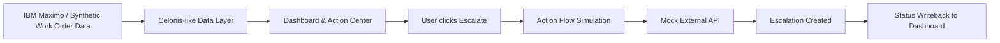

# Architecture: Celonis + Maximo Work Order Action Hub

## Concept

This demo simulates a possible future architecture where Maximo work order data is analyzed in Celonis and operational actions are triggered through Action Flows and external APIs.

The local demo does not connect to real Celonis or real Maximo. It uses synthetic data and a mock API to explain the concept.

## High-level architecture

## Real-world target architecture

```mermaid
flowchart LR
    A[IBM Maximo Work Orders] -->|Connector / API / Ingestion| B[Celonis Data Pool]
    B --> C[Transformations]
    C --> D[Celonis Data Model]
    D --> E[Knowledge Model / KPIs]
    E --> F[Celonis View: Action Center]
    F -->|Button click / table action| G[Action Flow]
    G -->|HTTP / MuleSoft / ServiceNow / Maximo API| H[External Execution System]
    H --> I[Escalation / Notification / Ticket]
    I --> J[Writeback Status]
    J --> F
```

## Key components

### Data Layer

The data layer contains work order records with fields such as work order ID, asset, priority, status, due date, technician, failure code, SLA status, and escalation status.

### Dashboard

The dashboard provides KPI monitoring and exception filtering.

### Action Center

The Action Center shows the work orders that need attention and allows the user to trigger a follow-up action.

### Action Flow Simulation

In a real Celonis implementation, an Action Flow would receive selected work order details from the View and call an external API.

### Mock API

The mock API simulates the external action, such as creating an escalation ticket or sending a notification.

## Core value

The solution is designed to move users from passive monitoring to active resolution:

**Insight → Prioritization → Action → Tracking**
