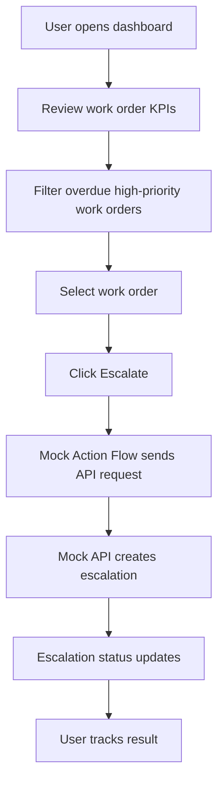

# User Flow

```mermaid
flowchart TD
    A[User opens dashboard] --> B[Review work order KPIs]
    B --> C[Filter overdue high-priority work orders]
    C --> D[Select work order]
    D --> E[Click Escalate]
    E --> F[Mock Action Flow sends API request]
    F --> G[Mock API creates escalation]
    G --> H[Escalation status updates]
    H --> I[User tracks result]
```
